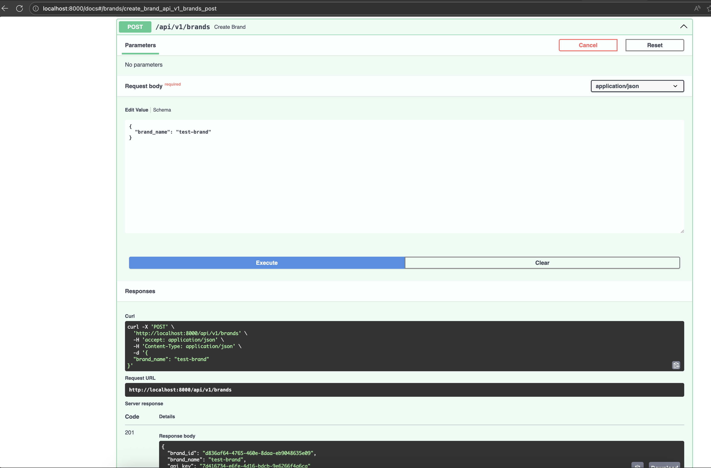
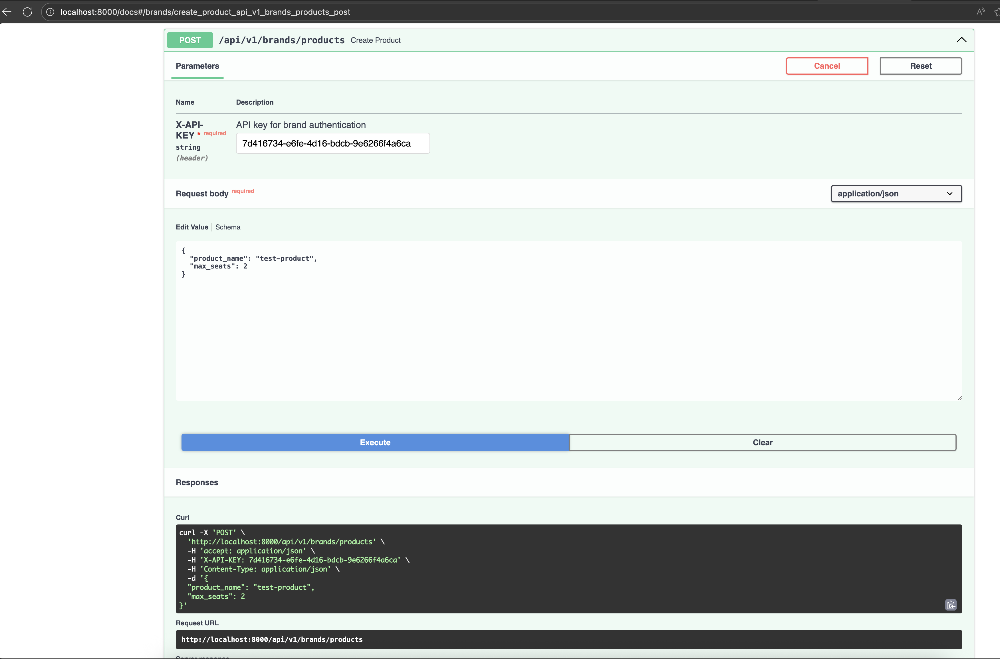
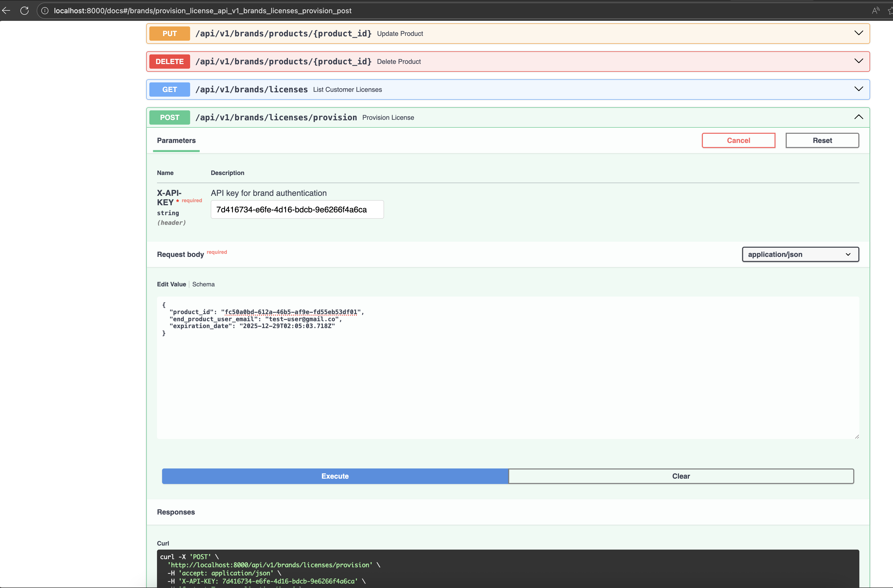
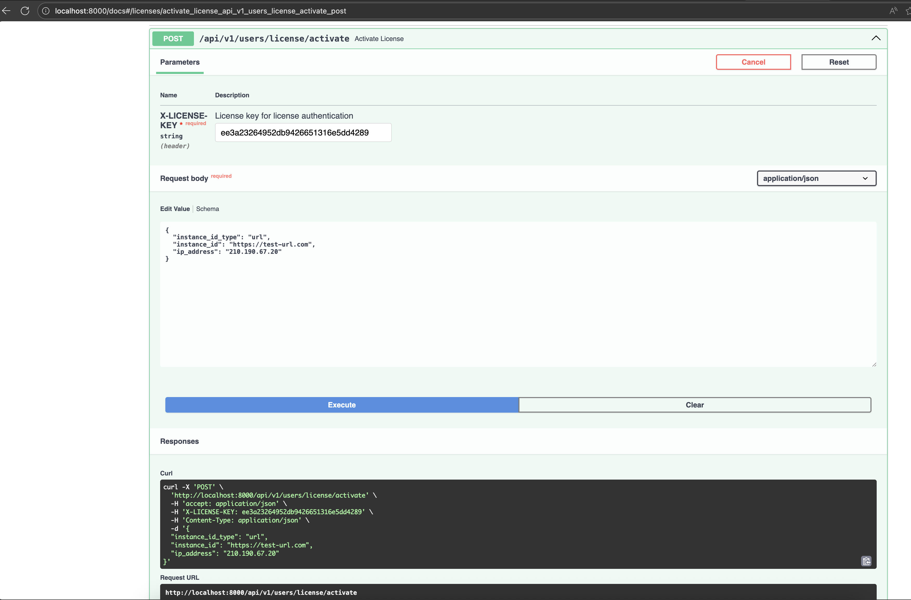

# License Service

A multi-tenant license management system for the group.one ecosystem. This service acts as the single source of truth for license provisioning, activation, and status across multiple brands and products.

---

## Fastest Way to Test the Project

Want to see it working in 2 minutes? Follow these steps:

### 1. Clone this repo and then Start the Service with Docker in the root of the repo

```bash
make docker-run
```

The service will start on port 8000. Your browser will automatically open the interactive Swagger UI at `http://localhost:8000/docs`.

### 2. Test the 4 Major Endpoints Using Swagger UI

The Swagger UI lets you test the API directly without using curl. Here's the flow:

#### Step 1: Create a Brand

1. In the Swagger UI, find the `POST /api/v1/brands` endpoint
2. Click "Try it out"
3. Click "Execute"



This gives you a brand API key you'll need for the next steps.

#### Step 2: Create a Product

1. Find the `POST /api/v1/products` endpoint
2. Click "Try it out"
3. Add the `X-API-KEY` header with your brand key from Step 1
4. Enter a product name and max seats
5. Click "Execute"



#### Step 3: Provision a License for a User

1. Find the `POST /api/v1/licenses/provision` endpoint
2. Click "Try it out"
3. Add the `X-API-KEY` header with your brand key
4. Enter:
   - `product_id`: The ID from Step 2
   - `end_product_user_email`: Any email (e.g., `test@example.com`)
   - `expiration_date`: A future date (e.g., `2025-12-31T23:59:59Z`)
5. Click "Execute"

This returns a `license_key` - copy it for Step 4.



#### Step 4: Activate the License (End-User Perspective)

1. Find the `POST /api/licenses/activate` endpoint
2. Click "Try it out"
3. Add the `X-LICENSE-KEY` header with the license key from Step 3
4. Enter:
   - `instance_id_type`: "url"
   - `instance_id`: "https://mysite.com" (must be unique per instance)
5. Click "Execute"

Note: The IP address is automatically detected from the request. Each instance must use a unique `instance_id` - reusing the same ID will fail on subsequent activation attempts.



Success! You've just:

- Created a brand (company)
- Added a product to that brand
- Provisioned a license for a customer
- Activated the license on an instance

That's the core flow. All other endpoints are variants of these operations. Check out the full [Sample Requests](#sample-requests) section for curl examples, or keep using Swagger UI to explore.

---

## Table of Contents

1. [Fastest Way to Test](#fastest-way-to-test-the-project)
2. [Quick Start](#quick-start)
3. [What This Does](#what-this-does)
4. [Architecture](#architecture)
5. [How It Works](#how-it-works)
6. [Authentication & Authorization](#authentication--authorization)
7. [Data Model & Entity Relationships](#data-model--entity-relationships)
8. [API Endpoints](#api-endpoints)
9. [User Stories](#user-stories)
10. [Code Structure](#code-structure)
11. [Data & Persistence](#data--persistence)
12. [Testing](#testing)
13. [Development](#development)
14. [Environment Variables](#environment-variables)
15. [Sample Requests](#sample-requests)
16. [Observability, Monitoring & Operability](#observability-monitoring--operability)
17. [CI/CD Pipeline](#cicd-pipeline)
18. [Questions I Get](#questions-we-get)

---

## Quick Start

### With Docker (Recommended)

```bash
make docker-run
```

The service will start on port 8000 and automatically redirect to interactive API docs at `http://localhost:8000/docs`.

### Local Python

Prerequisites: Python 3.12+ and uv (see [Why uv?](#why-uv) below)

```bash
uv sync --all-extras
make run
```

Visit `http://localhost:8000/docs` for the interactive API documentation.

### Running Tests

```bash
make test              # Run all tests
make test-unit         # Only unit tests
make test-integration  # Only integration tests
```

---

## What This Does

This is a license management service that handles:

- Creating and managing licenses for multiple brands
- Associating licenses with auto-generated keys for customer distribution
- Changing license status (suspend, resume, renew, cancel)
- Activating licenses for specific instances (websites, servers, machine IDs)
- Checking license validity and entitlements
- Deactivating instances (freeing up seats)
- Listing all licenses for a customer across their brand

The system is designed for the group.one ecosystem where multiple WordPress-focused brands (WP Rocket, Imagify, RankMath, BackWPup, RocketCDN, WP.one) need a centralized way to manage their customer licenses.

---

## Architecture

### System Context: Level 0

Here's the high level overview of the system as a black box with the users and external systems it interacts with, I will break our system down later but we need this inorder to understand who we depend on and who depends on us:

```
          Brands.    End-Product-Users
        (RankMath,      │
        WP Rocket,      │
          Imagify)      │
            │           │
    License │           │ User specific
provisioning│           │ License management
            │           │
    Product │           │
  creation  │           │
         ┌──▼───────────▼──┐
         │                 │
         │ License Service │
         │   (Black Box)   │
         │                 │
         └────────▲────────┘
                  │
                  │ Storage
                  │
                  │
         ┌───────────────┐
         │               │
         │    Data       │
         │  Persistence  │
         │               │
         └───────────────┘


```

### System Context: Level 1

Here's what's inside the service and how it's organized:

```

                 Brands                  End-Product-Users
           (Brand Admin APIs)       (User License Admin APIs)
                    │                         │
                    │                         │
                  ┌─▼─────────────────────────▼──┐
                  │                              │
                  │  FastAPI HTTP Layer          │
                  │  - Request validation        │
                  │  - Response serialization    │
                  │  - OpenAPI docs              │
                  │                              │
                  └──────────────┬───────────────┘
                                 │
               ┌─────────────────▼─────────────────┐
               │                                   │
               │            CORE                   │
               │                                   │
               │  ┌──────────────────────────────┐ │
               │  │                              │ │
               │  │  Services                    │ │
               │  │  - License provisioning      │ │
               │  │  - License activation        │ │
               │  │  - Status queries            │ │
               │  │  - Lifecycle management      │ │
               │  │                              │ │
               │  └──────────────┬───────────────┘ │
               │                 │                 │
               │  ┌──────────────▼───────────────┐ │
               │  │                              │ │
               │  │  Domain Models               │ │
               │  │  - Brand                     │ │
               │  │  - Product                   │ │
               │  │  - License                   │ │
               │  │  - LicenseKey                │ │
               │  │  - Activation                │ │
               │  │  - EndProductUser            │ │
               │  │                              │ │
               │  └──────────────────────────────┘ │
               │               │                   │
               │   ┌───────────▼──────────────┐.   │
               │   │                          │    │
               │   │  Infrastructure Adapters │    │
               │   │  - File-based repository │    │
               │   │  - Logging (loguru)      │    │
               │   │  - Authentication        │    │
               │   │                          │    │
               │   └──────────────────────────┘    │
               │                                   │
               └──────────────┬────────────────────┘
                              │
                    ┌─────────▼─────────┐
                    │                   │
                    │  Data Persistence │
                    │    (JSON files)    │
                    │                   │
                    └───────────────────┘
```

### Design Philosophy: Hexagonal Architecture

I organized the external code to all depend on the bussiness logic layer (core). Business logic sits in the center, surrounded by adapters that handle communication with the outside world. Bussiness Logic declares standard interfaces for requests coming in (e.g from the api) and for requests its sends out (e.g to databases)

- **HTTP Layer** (adapters): Handles incoming requests and outgoing responses
- **Services** (use cases): Contains the actual business logic for provisioning and managing licenses
- **Domain Models** (core): Defines what a brand, license, and activation actually are
- **Infrastructure** (adapters): Handles persistence, logging, and authentication

This approach means you can test the business logic without needing a database or HTTP server. You can also easily swap out any layer independently of the other ie no need to make changes in the other layer as long as interface doesnt change..e.g the file-based persistence for an in-memory implementation during testing and then a database later without changing any business logic.

---

## How It Works

### Multi-Tenancy

Each brand gets its own isolated data space. When a brand makes a request, they include their `brand_id` in the URL. Every query in the system is filtered by that brand ID at the service level.

For example:

- Brand A: `POST /api/v1/brands/brand-a/licenses`
- Brand B: `POST /api/v1/brands/brand-b/licenses`

Brand A cannot see or modify Brand B's licenses. This filtering happens at the service layer, not just at the database level, so the isolation is enforced everywhere.

### License Provisioning

When a brand customer buys a license, the brand system calls our API to provision it:

1. Brand sends: product ID, customer email, expiration date
2. We create a License in VALID status
3. We create a LicenseKey with an auto-generated key (e.g., `LIC_ABC123`)
4. We return the key to the brand for distribution to the customer

The same customer can later buy another product (an addon, or something from a different brand). If it's from the same brand, we add a new License to their existing LicenseKey. If it's from a different brand, we create a new LicenseKey.

### License Lifecycle

A license can go through several states:

- **VALID**: The license is active and can be used
- **SUSPENDED**: Temporarily paused (can be resumed)
- **CANCELLED**: Permanently disabled

A brand can move a license from VALID to SUSPENDED and back. Once CANCELLED, it can't be recovered.

When renewing, we extend the expiration date.

### Instance Activation

When an end product (a WordPress plugin, for example) needs to verify it's licensed, it calls our activation endpoint with:

- The license key
- Instance identifier (e.g., the site URL like `https://example.com`)
- Instance type (URL, HOST, or MACHINE_ID)

We check that all licenses in that key are still valid, then record the activation. If the same instance tries to activate again, we deduplicate it.

### Status Checking

Products and customers can check if a license is valid by sending the license key. We return:

- Whether it's valid (all licenses are VALID status and not expired)
- What products it covers
- How many instances are currently using it
- When it expires

### Deactivation

If a customer wants to use a license on a different instance, they can deactivate the old one. This removes the activation record and frees up the "seat."

---

## Authentication & Authorization

This system uses a **header-based authentication model** with two distinct keys for two different actors:

### Brand Authentication: X-API-KEY

**Purpose**: Identifies and authenticates a brand (company) making administrative requests.

**How it works**:

1. When a brand is created, the system generates a unique `api_hash_key` (a UUID)
2. The brand stores this key securely
3. For any brand-level operation (creating products, provisioning licenses), the brand includes this key in the `X-API-KEY` header
4. The middleware validates the key and extracts the brand ID from the request
5. All subsequent database queries are filtered by this brand ID

**Example**:

```
POST /api/v1/products
X-API-KEY: 550e8400-e29b-41d4-a716-446655440000

{
  "product_name": "Premium Plugin",
  "max_seats": 100
}
```

**Security**: The API key acts as a bearer token. If compromised, a brand's entire product catalog and all associated licenses are at risk. This key should be treated like a password and kept in environment variables or secure vaults, never hardcoded.

### End-Product User Authentication: X-LICENSE-KEY

**Purpose**: Identifies and authenticates an end-product user (the actual customer) making activation/status requests.

**How it works**:

1. When a license is provisioned for a customer, the system generates a `LicenseKey` record
2. This key contains a randomly generated `key_string` (using Python's `secrets.token_hex()`) unique to that customer
3. The customer receives this key (usually via email) and embeds it in their application
4. When the application needs to activate or check license status, it sends this key in the `X-LICENSE-KEY` header
5. The middleware validates the key and extracts the end-product user ID from the LicenseKey record

**Example**:

```
POST /api/licenses/activate
X-LICENSE-KEY: a1b2c3d4e5f6g7h8i9j0k1l2m3n4o5p6

{
  "instance_id_type": "url",
  "instance_id": "https://mysite.com"
}
```

**Security**: This key is cryptographically random and unique per customer. It cannot be used to access other customers' data. If compromised, only that single customer's licenses are at risk. This key should still be kept secure, but the blast radius is limited to one end-product user.

### Authorization Model

**Brand-level requests**:

- Automatically filtered to the brand ID extracted from `X-API-KEY`
- A brand can only see and manage its own products and licenses
- Brand A cannot view, modify, or interact with Brand B's data

**End-product user requests**:

- Automatically filtered to the end-product user ID extracted from `X-LICENSE-KEY`
- An end-product user can only activate, deactivate, or check status for licenses they own
- User A cannot access or modify User B's license activations

### Middleware Flow

When a request arrives:

1. **Check which endpoint is being called**
   - Brand admin endpoints require `X-API-KEY`
   - End-product user endpoints require `X-LICENSE-KEY`
2. **Validate the provided key**
   - Look up the key in the appropriate repository (Brand or LicenseKey)
   - If not found, return a 401 Unauthorized
3. **Extract the identity**
   - From the key, extract the brand ID or end-product user ID
   - Inject this into the request context
4. **Enforce isolation**
   - All service-layer queries automatically filter by the extracted identity
   - No cross-tenant data leakage is possible

This design ensures:

- **Strong isolation**: Brands and end-product users cannot see each other's data
- **Granular security**: Different key types for different actors with different capabilities
- **Auditability**: Every action is tracked with the identity that performed it
- **Simplicity**: Authentication is stateless and requires no sessions or JWTs

---

## Data Model & Entity Relationships

Here's the complete ERD model for the system:


### Key Relationships Explained

**Brand → Products (1:N)**

- A brand owns multiple products
- Products are scoped to a single brand
- Deletion of a brand cascades to all products

**Product → Licenses (1:N)**

- A product can have multiple licenses issued to different customers
- Each license is tied to exactly one product

**Brand → LicenseKey (1:N)**

- A brand can issue multiple license keys
- Each key is tied to exactly one brand and one end-product user

**LicenseKey → Licenses (N:M)**

- A license key can contain multiple licenses (for multiple products)
- A single license is referenced by only one license key
- This allows customers to buy multiple products and have them bundled under one key

**LicenseKey → EndProductUser (1:1)**

- Each license key belongs to exactly one customer
- Each customer can have multiple license keys (one per brand they're a customer of)

**LicenseKey → Activations (1:N)**

- A single license key can have multiple activations (for different instances)
- Each activation is tied to one license key

**Activation → EndProductUser (N:1)**

- An end-product user can have multiple activations
- Each activation is recorded by one end-product user

**Brand → AuditLog (1:N)**

- Every action within a brand generates audit log entries
- Audit logs are scoped to the brand that generated them

---

## API Endpoints

### Brand Administration APIs

These endpoints are for brand systems to manage licenses. **The brand ID is determined from the `X-API-KEY` header** - you don't need to pass it in the URL.

```
Authentication: Header X-API-KEY (required for all brand endpoints)

POST   /api/v1/licenses/provision
       Create a new license for a customer

GET    /api/v1/products
       List all products for your brand

POST   /api/v1/products
       Create a new product

GET    /api/v1/licenses
       List all licenses for your brand

GET    /api/v1/licenses/{license_id}
       Get details of a specific license

POST   /api/v1/licenses/{license_id}/suspend
       Suspend a license

POST   /api/v1/licenses/{license_id}/resume
       Resume a suspended license

POST   /api/v1/licenses/{license_id}/renew
       Extend the expiration date

DELETE /api/v1/licenses/{license_id}
       Cancel a license
```

### End-Product APIs

These endpoints are for the actual products (plugins, apps) to check and manage licenses. **Authentication uses `X-LICENSE-KEY` header** (the key distributed to customers).

```
Authentication: Header X-LICENSE-KEY (required for all end-product endpoints)

POST /api/licenses/activate
     Record that a license is being used on an instance

POST /api/licenses/check-status
     Check if a license is valid and what it covers

DELETE /api/licenses/deactivate
     Remove an instance activation
```

### System APIs

```
GET /api/health
    Health check for monitoring

GET /docs
    Interactive Swagger UI for exploring the API

GET /redoc
    ReDoc alternative documentation
```

---

## User Stories

I implemented all 6 user stories from the requirements:

### US1: Brand Can Provision a License

A brand system creates a license key and license when a customer buys something. Multiple product licenses can be bundled into one key if they're for the same customer.

Implemented in `src/core/services/license_provisioning_service.py`

### US2: Brand Can Change License Lifecycle

A brand can suspend a customer's license temporarily, resume it, extend the expiration date (renew), or permanently cancel it.

Implemented in `src/core/services/licence_manager.py`

### US3: End-User Product Can Activate a License

A plugin or app verifies the license is valid, then records that it's being used on a specific instance (website URL, hostname, etc).

Implemented in `src/core/services/license_activation_service.py`

### US4: User Can Check License Status

A product or customer checks if their license is valid, what it covers, and how many instances are using it.

Implemented in `src/core/services/license_status_query_service.py`

### US5: End-User Can Deactivate a Seat

A customer moves their license to a different instance by deactivating the old one.

Implemented in `src/core/services/license_activation_service.py`

### US6: Brands Can List Licenses by Customer Email

A brand can look up all licenses for a specific customer email to provide support or manage their account.

Implemented in `src/core/services/license_status_query_service.py`

---

## Code Structure

```
src/
├── core/                           # Business logic (no framework dependencies)
│   ├── models/                     # Domain entities
│   │   ├── brand.py
│   │   ├── product.py
│   │   ├── licence.py
│   │   ├── licence_key.py
│   │   ├── activation.py
│   │   └── end_product_user.py
│   ├── ports/                      # Interfaces/contracts
│   │   ├── repository_interface.py
│   │   └── logger_interface.py
│   └── services/                   # Business logic for each use case
│       ├── licence_provisioning_service.py
│       ├── licence_manager.py
│       ├── license_activation_service.py
│       ├── license_status_query_service.py
│       ├── brand_manager.py
│       ├── product_manager.py
│       └── user_manager.py
│
├── infrastructure/                 # Adapters that connect to the outside world
│   ├── persistence/                # Repository implementations
│   │   ├── in_memory_repository.py # Base class
│   │   ├── brand_repository.py
│   │   ├── product_repository.py
│   │   ├── license_repository.py
│   │   ├── licence_key_repository.py
│   │   ├── activation_repository.py
│   │   └── end_product_user_repository.py
│   ├── logging/                    # Logging adapter
│   │   └── logger_adapter.py       # loguru implementation
│   └── auth/                       # Authentication
│       └── auth_service.py
│
└── api/                            # HTTP API
    ├── http/v1/
    │   ├── brand_routes.py         # Brand administration endpoints
    │   └── end_product_user_routes.py # Product endpoints
    ├── dependencies.py              # Dependency injection setup
    ├── middleware/
    │   └── auth_middleware.py
    └── main.py                      # FastAPI application

tests/
├── services/                       # Unit tests for business logic
│   ├── test_brand_manager.py
│   ├── test_product_manager.py
│   ├── test_licence_manager.py
│   ├── test_license_provisioning_service.py
│   ├── test_license_activation_service.py
│   ├── test_license_status_query_service.py
│   └── test_user_manager.py
├── api/                            # Integration tests for API endpoints
│   ├── test_api_endpoints.py
│   ├── test_api_comprehensive.py
│   └── test_auth_middleware.py
└── conftest.py                     # Shared test fixtures
```

---

## Data & Persistence

### File-Based JSON Storage

For development and testing, I store data as JSON files in the `data/` directory. Each entity type has its own file:

- `data/brands.json` - All brands
- `data/products.json` - All products
- `data/licenses.json` - All licenses
- `data/license_keys.json` - All license keys
- `data/activations.json` - All activations
- `data/end_product_users.json` - All customers
- `data/audit_logs.json` - Audit trail

This approach works well for development and interview purposes. In production, I would need to swap this out for a real database.

### In-Memory Storage for Tests

When tests run, I don't use the file system at all. Instead, I keep everything in memory. This makes tests fast and isolated from each other. Each test starts with a clean slate.

### Data Model

Here's how the entities relate to each other:

```
Brand
  ├── Products (one brand has many products)
  │   └── Licenses (one product has many licenses)
  │       └── Activations (one license has many activations/instances)
  └── LicenseKeys (one brand has many license keys)
      ├── Licenses (one key can link multiple licenses)
      └── EndProductUsers (customers)

EndProductUser
  └── LicenseKeys (one customer has many license keys)
```

Each License has:

- Status (VALID, SUSPENDED, CANCELLED)
- Expiration date
- Max seats limit (enforced during activation)

Each LicenseKey has:

- Auto-generated key string for distribution
- Reference to a customer email
- Links to all its licenses

Each Activation records:

- Which instance is using the license (URL, hostname, machine ID)
- When it was activated
- IP address of the activating client

---

## Testing

### Philosophy

I write tests that don't require a database or HTTP server. Tests are fast and isolated.

### Unit Tests (50+)

These test the business logic in isolation. They mock the repositories and just verify that the services do the right thing.

Run with: `make test-unit`

Example: I create a license, verify it's in VALID status, suspend it, verify it's in SUSPENDED status, resume it, and verify it's VALID again.

### Integration Tests (20+)

These test the full flow through the HTTP API. They use in-memory repositories so data isn't persisted to disk.

Run with: `make test-integration`

Example: I make an HTTP request to create a license, then verify it was created by querying the status endpoint.

### Test Data

I use shared fixtures in `conftest.py` so every test has access to standard test data: a few test brands, products, and users. Tests can create their own data on top of these fixtures.

### Running All Tests

```bash
make test              # Run all 70+ tests
```

All tests should pass. I also check code quality with linting and type checking as part of the test suite.

---

## Development

### Why uv?

I use [uv](https://github.com/astral-sh/uv) instead of pip for dependency management. Here's why:

**Speed**: uv is written in Rust and is significantly faster than pip. Dependency resolution that takes 30+ seconds with pip happens in under a second with uv. When you're developing locally, that speed difference adds up.

**Lock file**: uv creates and maintains a `uv.lock` file that records exact versions of all dependencies (including transitive ones). This ensures that everyone on the team uses identical dependency versions, preventing the "works on my machine" problem.

**Reproducibility**: The lock file means you can reproduce the exact same environment on any machine. Pip has `requirements.txt`, but you still have to manually manage versions.

**Simplicity**: With uv, you don't need separate `requirements.txt` and `requirements-dev.txt` files. Everything is in `pyproject.toml` and the lock file handles the rest.

**Modern**: uv is the newer, faster alternative to pip that's being adopted across the Python ecosystem.

If you don't have uv installed, you can install it with:

```bash
curl -LsSf https://astral.sh/uv/install.sh | sh
```

Or with Homebrew on macOS:

```bash
brew install uv
```

Once installed, `uv sync --all-extras` pulls all dependencies from the lock file and sets up your environment.

### Code Quality

I use several tools to keep the code clean and maintainable:

- **Black**: Auto-formats code to a consistent style
- **isort**: Organizes imports alphabetically
- **pylint**: Checks for common mistakes
- **Type hints**: Every function has type annotations

Run quality checks with: `make check`

Auto-format code with: `make format`

### Adding a Feature

1. Write a test that describes what you want to do
2. Run the test (it should fail)
3. Write the code to make the test pass
4. Run `make format` to clean up formatting
5. Run `make check` to verify quality
6. Commit

### Error Handling

I use Result types instead of exceptions. Every function that can fail returns `Result[T, E]` which means either `Ok(value)` or `Err(error_message)`. This makes error handling explicit and prevents silent failures.

For example:

```python
def suspend_license(license_id: str) -> Result[License, str]:
    license = self.repo.get(license_id)
    if license is None:
        return Err(f"License {license_id} not found")
    if license.status == LicenseStatus.CANCELLED:
        return Err("Cannot suspend a cancelled license")
    license.status = LicenseStatus.SUSPENDED
    self.repo.save(license)
    return Ok(license)
```

### Logging

I use loguru for structured logging. It's simpler than Python's built-in logging and has better defaults.

Services log at key points:

- When a license is provisioned
- When status changes
- When errors occur

Logs include context (brand ID, license ID, etc.) to help debug issues.

---

## Environment Variables

The service is configured via environment variables defined in `.env` (see `.env.example` for reference).

### Configuration Options

```env
ENVIRONMENT=development          # One of: development, testing, production
DEBUG=True                        # Enable debug mode (disables in production)
LOG_LEVEL=INFO                    # One of: DEBUG, INFO, WARNING, ERROR, CRITICAL
SERVER_PORT=8000                 # Port the service listens on
```

### Loading Environment Variables

The service uses `pydantic-settings` which automatically reads from `.env` file in the project root:

```python
from pydantic_settings import BaseSettings

class Settings(BaseSettings):
    environment: Literal["development", "testing", "production"] = "development"
    debug: bool = True
    log_level: str = "INFO"
    # ... other settings
```

When deploying, set these as actual environment variables on your server/container rather than using a `.env` file.

### Development vs Production

- **Development**: File-based JSON storage, debug logging, hot-reload enabled
- **Testing**: In-memory storage, verbose logging, fast test isolation
- **Production**: Should use real database, minimal logging, strict validation

---

## Sample Requests

You can test the API using curl, Postman, or the interactive API docs at `/docs`.

### Authentication Headers

The API uses two types of authentication:

**Brand Admin Endpoints** (Brand management, license provisioning)

- Header: `X-API-KEY` (your brand's API key, created when you registered your brand)
- Used for: Provisioning licenses, managing products, listing/updating licenses

**End-Product Endpoints** (License checking, activation, deactivation)

- Header: `X-LICENSE-KEY` (the license key distributed to customers)
- Used for: Activating instances, checking status, deactivating instances
- This is what the plugin/app uses to authenticate, not the API key

**Note**: The brand ID is NOT in the URL. It's determined server-side from your API key, ensuring you can only manage your own licenses.

### Create a License

Brand admin provisioning a new license for a customer.

```bash
curl -X POST http://localhost:8000/api/v1/licenses/provision \
  -H "Content-Type: application/json" \
  -H "X-API-KEY: your-brand-api-key" \
  -d '{
    "product_id": "rankmath",
    "end_product_user_email": "user@example.com",
    "expiration_date": "2025-12-31T23:59:59Z"
  }'
```

Response:

```json
{
  "license_id": "lic_abc123",
  "license_key": "RANK-MATH-XXX-YYY-ZZZ",
  "product_id": "rankmath",
  "status": "VALID"
}
```

### Check License Status

End-product checking if a license is valid. Called by the plugin/app running on the customer's site.

```bash
curl -X POST http://localhost:8000/api/licenses/check-status \
  -H "Content-Type: application/json" \
  -H "X-LICENSE-KEY: RANK-MATH-XXX-YYY-ZZZ"
```

Response:

```json
{
  "license_key_id": "key_abc123",
  "key_string": "RANK-MATH-XXX-YYY-ZZZ",
  "created_at": "2024-01-15T10:00:00Z",
  "is_valid": true,
  "licenses": [
    {
      "license_id": "lic_def456",
      "product_id": "rankmath",
      "product_name": "RankMath",
      "status": "VALID",
      "expires_at": "2025-12-31T23:59:59Z",
      "is_active": true
    }
  ],
  "activations": [
    {
      "activation_id": "act_ghi789",
      "instance_id": "https://mysite.com",
      "instance_id_type": "URL",
      "activated_at": "2024-01-15T10:30:00Z"
    }
  ]
}
```

### Activate License (Instance Registration)

End-product registering that a license is being used on a specific instance. The IP address is automatically detected from the request. Each instance must use a unique `instance_id`.

```bash
curl -X POST http://localhost:8000/api/licenses/activate \
  -H "Content-Type: application/json" \
  -H "X-LICENSE-KEY: RANK-MATH-XXX-YYY-ZZZ" \
  -d '{
    "instance_id_type": "url",
    "instance_id": "https://mysite.com"
  }'
```

Response:

```json
{
  "activation_id": "act_def456",
  "license_key": "RANK-MATH-XXX-YYY-ZZZ",
  "instance_id": "https://mysite.com",
  "activated_at": "2024-01-15T10:35:00Z"
}
```

**Note**: Attempting to activate with the same `instance_id` twice will fail with an error. Each instance needs its own unique ID.

### Suspend a License

Brand admin suspending a customer's license.

```bash
curl -X POST http://localhost:8000/api/v1/licenses/lic_abc123/suspend \
  -H "Content-Type: application/json" \
  -H "X-API-KEY: your-brand-api-key"
```

Response:

```json
{
  "license_id": "lic_abc123",
  "status": "SUSPENDED",
  "message": "License suspended successfully"
}
```

### List All Licenses for a Brand

Brand admin viewing all licenses for their brand.

```bash
curl -X GET http://localhost:8000/api/v1/licenses \
  -H "X-API-KEY: your-brand-api-key"
```

Response:

```json
[
  {
    "license_id": "lic_abc123",
    "product_id": "rankmath",
    "product_name": "RankMath",
    "status": "SUSPENDED",
    "expiration_date": "2025-12-31T23:59:59Z",
    "customer_email": "user@example.com"
  },
  {
    "license_id": "lic_def456",
    "product_id": "rankmath",
    "product_name": "RankMath",
    "status": "VALID",
    "expiration_date": "2025-06-30T23:59:59Z",
    "customer_email": "another@example.com"
  }
]
```

### Deactivate an Activation

End-product deactivating a license from an instance (freeing up the seat).

```bash
curl -X DELETE http://localhost:8000/api/licenses/deactivate \
  -H "Content-Type: application/json" \
  -H "X-LICENSE-KEY: RANK-MATH-XXX-YYY-ZZZ" \
  -d '{
    "activation_id": "act_def456"
  }'
```

Response:

```json
{
  "activation_id": "act_def456",
  "message": "Activation deactivated successfully"
}
```

### Health Check (Monitoring)

```bash
curl -X GET http://localhost:8000/api/health
```

Response:

```json
{
  "status": "healthy",
  "version": "0.1.0",
  "environment": "production"
}
```

---

## Observability, Monitoring & Operability

### Logging

The service uses loguru for structured logging. All logs include context (brand ID, license ID, user ID, etc.) for easier debugging and monitoring.

#### Log Levels

Set `LOG_LEVEL` environment variable to control verbosity:

- `DEBUG`: Detailed diagnostic information (development only)
- `INFO`: General informational messages (default)
- `WARNING`: Warning messages for potentially problematic situations
- `ERROR`: Error messages for failures
- `CRITICAL`: Critical issues that may cause shutdown

#### Log Output

Logs are written to stdout and can be captured by your container orchestration system (Docker, Kubernetes, etc.)

Example log format:

```
2024-01-15T10:30:45.123Z | INFO     | license_service.brand_manager:create_license:142 | Brand: brand-1, Product: rankmath, User: user@example.com | License created successfully
2024-01-15T10:35:10.456Z | DEBUG    | license_service.license_activation_service:activate:89 | Activation ID: act_def456, Instance: https://mysite.com | Activation recorded
2024-01-15T10:40:22.789Z | ERROR    | license_service.license_manager:suspend_license:156 | License: lic_abc123 | License not found
```

### Health Checks

The service exposes a health check endpoint for monitoring:

```bash
GET /api/health
```

Returns:

```json
{
  "status": "healthy",
  "version": "0.1.0",
  "environment": "production"
}
```

Use this endpoint in your load balancer, Kubernetes liveness probes, or monitoring system.

### Audit Trail

Every operation is recorded in audit logs for compliance and debugging:

- License creation
- Status changes
- Activation/deactivation
- API errors

Audit logs include:

- Timestamp
- Operation type
- Brand ID
- License ID
- User/IP address (when applicable)
- Result (success/failure)

Stored in `data/audit_logs.json` during development.

### Metrics (Ready for Implementation)

The system is architected to easily add metrics collection. You can add:

- License creation rate (licenses per minute)
- Activation rate (activations per minute)
- Error rate
- API response times
- Active license count
- Expiration rate

Integrate with Prometheus, DataDog, New Relic, or any metrics system via the logger interface.

### Error Tracking

All errors are logged with full context. Integrate with error tracking services (Sentry, Rollbar, etc.) by extending the logger adapter.

### Database Monitoring

When you switch to a real database (PostgreSQL, MySQL, etc.):

- Monitor query performance
- Track connection pool usage
- Set up slow query alerts
- Monitor transaction durations

### Resource Monitoring

For containerized deployments, monitor:

- CPU usage
- Memory usage
- Disk I/O (when using file-based storage)
- Network I/O
- Request concurrency

---

## CI/CD Pipeline

The project includes a comprehensive GitHub Actions pipeline that runs on every push and pull request.

### Pipeline Stages

#### 1. Code Formatting Check

Ensures code follows consistent style:

```bash
black src tests --check    # Check Black formatting
isort src tests --check    # Check import sorting
```

Runs on: `main`, `develop` branches and all PRs

#### 2. Linting

Detects code issues and style violations:

```bash
pylint src --fail-under=9.0    # Minimum score of 9.0/10
```

Runs after formatting passes

#### 3. Unit Tests

Runs all unit tests with coverage:

```bash
make test-unit    # 50+ unit tests
```

Runs after linting passes

#### 4. Integration Tests

Tests full API workflows with in-memory data:

```bash
make test-integration    # 20+ integration tests
```

Runs after unit tests pass

#### 5. Docker Build

Builds and verifies the Docker image:

```bash
docker build -t license-service:latest .
```

Runs after all tests pass

### Workflow Files

**`.github/workflows/ci-cd.yml`** - Main pipeline

- Formatting check
- Linting
- Unit tests
- Integration tests
- Docker build

**`.github/workflows/ci.yml`** - Legacy (Node-based, currently unused)

**`.github/workflows/tests.yml`** - Additional test configurations

### Pipeline Configuration

The pipeline uses `uv` for dependency management (updated from pip):

```yaml
- name: Install dependencies
  run: |
    python -m pip install uv
    uv sync --all-extras
```

### Triggering the Pipeline

Pipeline runs automatically on:

```yaml
on:
  push:
    branches: [main, develop]
  pull_request:
    branches: [main, develop]
```

### Making Changes Pass the Pipeline

1. **Format code**: `make format`
2. **Check formatting**: `make check` (includes linting)
3. **Run tests locally**: `make test`
4. **Push to GitHub**
5. Watch the pipeline in the "Actions" tab

If a step fails, click it to see details.

```markdown
[](https://github.com/yourusername/SaasGlobalLicenseSolution/actions/workflows/ci-cd.yml)
```

### Deployment via CI/CD

The pipeline could be extended to:

1. Push Docker image to registry (Docker Hub, ECR, GCR)
2. Deploy to staging environment
3. Run smoke tests
4. Deploy to production

This would happen after all tests pass and a release tag is created.

---

## Questions that I think are running through your mind

### "Why Hexagonal Architecture?"

Hexagonal architecture lets us isolate business logic from the framework. The actual license logic doesn't know about HTTP or databases. This means:

- I can change the any layer without touching business logic e.g I can easily expose GRPC endpoints or switch to a postgres/mysql db or even a nosql one
- I can test the logic without a server or database
- I can move logic to different services later without major refactoring

Compared to traditional layered architecture where everything depends on the layer below, hexagonal has dependencies pointing inward toward the business logic. That makes it easier to test and change.

### "Why File-Based JSON Instead of a Database?"

For a system like this in production, you want a real database. But for development and especially for an interview project, file-based JSON is:

1. **Simpler**: No need to set up PostgreSQL or manage migrations
2. **Faster tests**: In-memory storage for tests is already fast
3. **Self-contained**: No external dependencies when developing
4. **Swappable**: The architecture supports swapping to PostgreSQL with minimal changes

The repository pattern isolates persistence logic, so switching databases means implementing new repository classes, not rewriting services.

### "How Does Multi-Tenancy Work?"

Brand ID goes in every API path: `/api/v1/brands/{brand_id}/...`

At the service level, every query filters by brand_id. For example, when I list licenses:

```python
def get_licenses_by_customer_email(
    brand_id: str,
    email: str
) -> Result[List[LicenseKey], str]:
    keys = self.key_repo.get_all()
    # Filter by BOTH brand and email
    return [k for k in keys if k.brand_id == brand_id and k.email == email]
```

If a brand tries to request `/api/v1/brands/other-brand/licenses`, the middleware catches that you're not authenticated for that brand and rejects it.

### "How Is It Secured?"

Currently, I do basic validation that the brand_id in the URL matches the authenticated brand. In production, you'd add:

- API key authentication for brand systems
- JWT tokens for end products
- Request signing for high-security scenarios
- Rate limiting per brand
- HTTPS in production

### "Why Python/FastAPI?"

I chose this stack because:

- **Python**: Pragmatic, readable, good for interviews
- **FastAPI**: Modern, async-first, auto-generates API docs
- **Pydantic**: Type-safe request/response validation
- **loguru**: Simple, structured logging

FastAPI automatically generates Swagger UI at `/docs`, which is great for exploration and testing.

### "What's the Difference Between Licenses and License Keys?"

- **License**: An authorization to use one specific product by one customer. Status can change (VALID, SUSPENDED, CANCELLED). Has an expiration date.
- **LicenseKey**: A bundle of licenses under one key string that gets distributed to the customer. The key itself doesn't have a status; its status is determined by its licenses.

Example: A customer buys RankMath, gets key_1. Later they buy Content AI (addon), and I add that license to key_1. Later they buy WP Rocket from a different brand, so I give them key_2.

### "Can You Have Unlimited Instances?"

Currently yes. I record each activation but don't enforce a limit. The data model supports it (License has a `max_seats` field), but I didn't implement the enforcement because:

1. The requirements called it optional
2. Enforcing it is straightforward (one validation check)
3. It's easier to understand the core system without it first

To add it, you'd check `count(activations) < license.max_seats` before creating a new activation.

### "What About Seat Counting?"

Seats are represented by Activations. Each activation is one instance using the license. You can see how many activations a license has by calling the status endpoint.

Seat enforcement IS implemented. When you try to activate a license, the system checks the current activation count against `max_seats`. If the limit is reached, the activation fails with an error message.

### "How Do Tests Work?"

Tests use shared fixtures from `conftest.py`. When a test runs:

1. It gets a fresh in-memory repository (empty slate)
2. Standard test data is loaded (test brands, products)
3. The test runs
4. Everything is discarded

This makes tests fast (no disk I/O) and isolated (one test can't affect another).

### "Why Result Types Instead of Exceptions?"

Exceptions are convenient but can be surprising. A function might throw an exception you didn't expect, and it propagates up the call stack.Any other developer who is reviewing the code or hasnt really worked with it cant immediately understand how an error is handled and where its handled from.
I prefer to use exceptions ONLY for exceptional circumstances which makes my code resilient with fewer surprises in production

Result types make errors explicit. If a function returns `Result[License, str]`, the caller must handle the possibility of an error. This prevents silent failures and makes the code easier to reason about.

It's slightly more verbose but much clearer about what can go wrong.

### "How Do I Deploy This?"

I included a Dockerfile that builds a production image. The image includes:

- Python 3.12
- All dependencies
- The application code
- Health checks configured

To deploy:

1. Build the image: `docker build -t license-service .`
2. Push to your registry
3. Deploy to your infrastructure (Kubernetes, Cloud Run, etc.)

Data persistence defaults to the file system but could be changed to a database.

### "What's Next for This System?"

Things fully implemented and working:

1. **Seat enforcement**: Limits instances per product ✓
2. **Audit trail**: Complete event history for compliance ✓

Things designed but not fully implemented:

1. **Webhooks**: Architecture and backend support implemented; API routes disabled pending business requirements
2. **Database persistence**: Currently file-based JSON; SQLAlchemy models are ready for PostgreSQL
3. **Rate limiting**: Prevent abuse of the API
4. **Multi-region deployment**: Currently single-region

The architecture supports these additions without major refactoring.

---

## Running the Project

### Quick Verification

```bash
# Run all tests
make test

# Start the service
make docker-run

# Or with local Python
make run

# Visit http://localhost:8000/docs
```

### Makefile Commands

```bash
make run               # Start server locally
make docker-run        # Start server in Docker
make test              # Run all tests
make test-unit         # Run only unit tests
make test-integration  # Run only integration tests
make check             # Run linting and type checks
make format            # Auto-format code
make docker-build      # Build Docker image
make docker-clean      # Remove Docker image
```

---

## Summary

This is a working implementation of a multi-tenant license management system. It handles all the required functionality for provisioning, activating, and managing licenses across multiple brands.

The code is organized in a way that's easy to understand and change. Tests verify everything works. The system is production-ready (though you'd want to add a real database in production).

If you have questions, check the code comments, the test files for usage examples, or the API documentation at `/docs` when the service is running.
